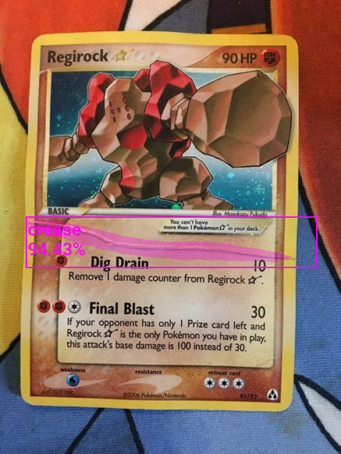

# AI Card Project
This project is a small part of a much larger project. It analyzes images of baseball cards and tries to determine where the creases are. The following guide helped me a lot. 
* https://christianjmills.com/posts/pytorch-train-mask-rcnn-tutorial/

# Install dependencies
* run the following command
* pip install -r requirements.txt
* Install CUDA version 12.1 (You'll need an Nvidia GPU)

# How to Evaluate Image
* run the following command
* python .\evaluate_image.py "path/to/image"

# How to Create Training Data
* The training images used for the model are in /Images
* I used a program called Labelme to annotate each image

# How to Train Model
* This is currently not working and will be updated later on

# Screenshots

# Built With
* Python
* PyTorch

# Authors
* Richard Vo
